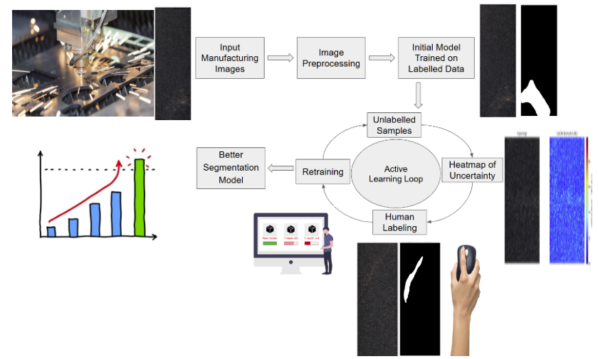

# Active Learning-Based Image Segmentation for Fault Detection

**Author:** Mohammad Raziuddin Chowdhury  
**Course:** Capstone Project  
**Date:** 4th April, 2025  

## Overview

This project implements an Active Learning framework for semantic segmentation of surface defects using the KolektorSDD2 dataset. We compare baseline training on the full dataset vs. an active learning loop that iteratively selects the most informative samples to label. An initial model for the active learning is trained on 50% of the total training data which will be used to do the active learning iterations.



The core model is a U-Net architecture with an EfficientNet-B4 as encoder, trained with Dice + Focal loss.

```
Capstone/
├── src/
│   ├── model.py                 # U-Net model with EfficientNet-B4 (for baseline and active learning initial model)
│   ├── utils.py                 # Training, plotting, visualization etc.functiions 
│   ├── prepare_data.py          # Dataset preparation utilities
│   ├── aug_torchdataset.py      # Dataset class + data augmentation pipelines
│   ├── evaluation.py            # Metric evaluation functions (IoU, Dice, etc.)
│   └── active_learning.py       # Active learning loop logic
│
├── models/
│   ├── al_model.pt
│   ├── baseline_model.pt
│   ├── al_model_initial.pt
│
├── log/
│   ├── training_log.txt         # log containing every important details about a run for both training and testing of baseline and active learning
│
├── data/
│   ├── KolektorSDD2.zip         # (Added instructions to download in the readme file)
│   ├── train_images/            # Training images (Will put some samples because dataset is large)
│   ├── train_masks/             # Training masks (Will put some samples because dataset is large)
│   ├── test_images/             # Test images (Will put some samples because dataset is large)
│   ├── test_masks/              # Test masks (Will put some samples because dataset is large)
│   ├── train_data.csv           # Metadata for training 
│   ├── test_data.csv            # Metadata for test
│
├── figure/
│   ├── baseline_model_loss.jpg
│   ├── initial_al_model_loss.jpg
│
├── main.IPYNB                   # Runs baseline training and active learning
├── model_trainer.py             # prepare data and train and log
├── test_models.py               # test models on test data and show predictions
├── requirements.txt
└── README.md
```


## Installation Instructions
1. Clone the Repository
   ```
   git clone https://github.com/RaziGooner/Capstone.git
   cd Capstone
   ```
2. Set up the Environment
   ```
   pip install -r requirements.txt
   ```


## Dataset Preparation & Training
Download the KolektorSDD2 dataset from https://www.vicos.si/resources/kolektorsdd2/  

The steps to prepare data is included in the run_trainer.py.  
This file will:  
1. prepare data for training,
2. Create the necessary data splits and dataloaders,
3. Initialize the baseline model, initial model for active learning and train them with the default hyperparameters,
4. Will set the active learning loop off following the default hyperparameters,
5. Save both the baseline and active learnig model (after active learning iterations)
6. Evaluate both the models on the test set defined by the dataset authors
7. will save all the necessary and important information in the log file.


Need to mention a base directory and the path to the downloaded zip file(dataset) to run the run_trainer.py file

```
python run_training.py --base_dir Capstone --zip_path ./Capstone/KolektorSDD2.zip
```


## Testing

The test_moddels file will give you the predictions for 3 samples from the test set for both the baseline model and the active learning model


## Notebook 'main.IPYNB'
This main notebook has all the outputs for a run and will provide a good overlook.

## Results

#### These results are not final and just results shown for one run. We will do multiple runs and do statistical testing to determine if the active learning model is significantly better than the baseline model


| Metric    | Baseline Model | Active Learning Model |
|-----------|----------------|------------------------|
| IoU       | 0.64           | 0.66                   |
| Dice      | 0.73           | 0.76                   |
| Accuracy  | 0.99           | 0.99                   |
| Precision | 0.85           | 0.88                   |
| Recall    | 0.75           | 0.75                   |


## Acknowledgments
- Dataset: KolektorSDD2 by Visual Cognitive Systems Laboratory University of Ljubljana  
- Model Architectures: Base U-Net and EfficientNet-B4 encoders adapted from publicly available open-source libraries


